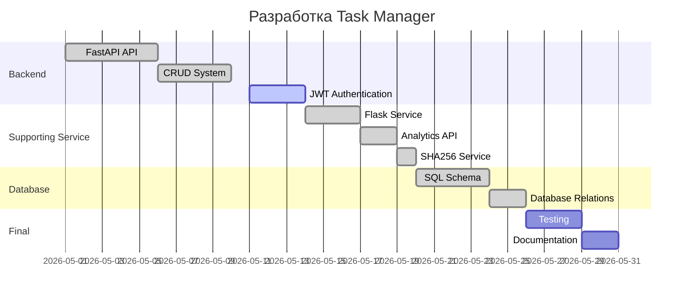

# Планировщик задач (Task Manager) 📋⏱️

**Task Manager** — это Full Stack web-приложение с элементами микросервисной архитектуры для управления личными и командными задачами. Проект помогает организовать рабочий процесс, контролировать дедлайны и отслеживать прогресс выполнения задач через удобный REST API и систему аналитики.

Проект разработан в рамках курса по базам данных и включает:
- FastAPI Core Service;
- Flask Supporting Service;
- SQL базу данных без ORM;
- JWT авторизацию;
- CRUD операции;
- аналитику и вспомогательные сервисы.

---

# Основные возможности ✨

## Управление задачами
- Создание задач;
- Изменение статусов;
- Установка дедлайнов;
- Приоритеты задач;
- Удаление и редактирование задач.

## Гибкая организация
- Группировка задач по проектам;
- Использование тегов;
- Фильтрация и сортировка задач.

## Канбан-доска
Поддержка Drag-and-Drop логики для визуального управления задачами:
- Нужно сделать;
- В процессе;
- Готово;
- Отложено.

## Аналитика
Supporting Service предоставляет:
- системную аналитику;
- hash endpoint;
- about endpoint;
- дополнительные API.

## Безопасность
- JWT авторизация;
- защищённые роуты;
- SHA256 hash service;
- разграничение ролей пользователей.

---

# Модели данных (Сущности) 🗂️

## Пользователь (User)

Поля:
- username
- password_hash
- role

Роли:
- user
- admin

---

## Проект (Project)

Объединяет задачи в группы.

Поля:
- Название;
- Дата создания;
- Владелец проекта.

---

## Задача (Task)

Основная сущность системы.

Поля:
- Название;
- Описание;
- Deadline;
- Статус;
- Приоритет;
- Проект;
- Теги.

Статусы:
- new
- in_progress
- done
- delayed

Приоритеты:
- low
- medium
- high

---

## Тег (Tag)

Используется для гибкой категоризации задач.

Поля:
- Название;
- Цвет.

---

# Архитектура проекта

```text
Client
   ↓
FastAPI Core Service
   ↓
MySQL Database
   ↓
Flask Supporting Service
```

## Core/Business Service — FastAPI

Отвечает за:
- регистрацию пользователей;
- авторизацию;
- CRUD операции;
- работу с задачами;
- бизнес-логику.

---

## Supporting Service — Flask

Отвечает за:
- аналитику;
- hash endpoint;
- about endpoint;
- вспомогательные API.

---

# Интерфейс и возможности 🚀

## Drag-and-Drop Kanban

Задачи могут перемещаться между статусами через Kanban board.

```text
TODO → IN PROGRESS → DONE
```

---

# Роли и доступ 👥

## Пользователь

Имеет доступ:
- к своим задачам;
- проектам;
- тегам;
- CRUD операциям.

---

## Администратор

Имеет доступ:
- к управлению пользователями;
- аналитике;
- системным операциям;
- ограничению пользователей.

---

# Стек технологий

## Backend
- Python
- FastAPI
- Flask

## Database
- MySQL
- SQL (без ORM)

## API
- REST API
- JWT Authentication

## Additional
- Git + GitHub
- Mermaid
- JSON
- SHA256

---

# Архитектура проекта

```text
Client
   ↓
FastAPI Core Service
   ↓
MySQL Database
   ↓
Flask Supporting Service
```

## Основные сущности базы данных

- users
- tasks
- projects
- tags
- time_tracking

## Связи

```text
users
 ├── projects
 ├── tasks
 ├── tags
 └── time_tracking
```

---

# Основные API endpoints

## FastAPI

### Регистрация
```http
POST /api/register
```

### Авторизация
```http
POST /api/login
```

### Получение профиля
```http
GET /api/users/{username}
```

### CRUD Tasks
```http
POST /api/tasks
GET /api/tasks
PUT /api/tasks/{task_id}
DELETE /api/tasks/{task_id}
```

---

## Flask Supporting Service

### Analytics
```http
GET /api/v1/supporting/analytics
```

### About
```http
GET /api/v1/supporting/about
```

### SHA256 Hash
```http
GET /api/v1/supporting/hash/{str}
```

---

# Как запустить проект

## 1. Клонировать репозиторий

```bash
git clone https://github.com/ColonelPavlov/Task_manager
cd Task_manager
```

---

## 2. Установить зависимости

### FastAPI

```bash
pip install fastapi uvicorn
```

### Flask

```bash
pip install flask
```

---

## 3. Запустить FastAPI

```bash
uvicorn main:app --reload
```

Сервис будет доступен:

```text
http://127.0.0.1:8000
```

---

## 4. Запустить Flask

```bash
python app.py
```

Сервис будет доступен:

```text
http://127.0.0.1:5001
```

---

# Диаграмма Ганта



---

# Git Workflow

## Ветки проекта

```text
main
 develop
 feature/*
 release/*
```

---

## Формат commit сообщений

```text
feat: add jwt authentication
fix: resolve login bug
docs: update readme
refactor: improve api structure
```

---

# Команда проекта

| Роль | Ответственность |
|---|---|
| Backend Developer | API, JWT, CRUD |
| Database Engineer | SQL, связи, репликация |
| Scrum Master / PM | GitHub, задачи, документация |
| QA | Тестирование API |

---

# Scrum Master Responsibilities

- Ведение GitHub Projects
- Создание Issues
- Планирование спринтов
- Контроль commit activity
- Подготовка документации
- Контроль выполнения ТЗ
- Организация командной работы

---

# Статус проекта

## Реализовано

- FastAPI service
- Flask supporting service
- SQL database schema
- CRUD endpoints
- Analytics endpoint
- SHA256 endpoint
- About endpoint

## В разработке

- JWT authentication
- Dashboard
- Database integration
- Protected routes
- Replication

---

# Лицензия

Educational project for Moscow Technology Institute.

