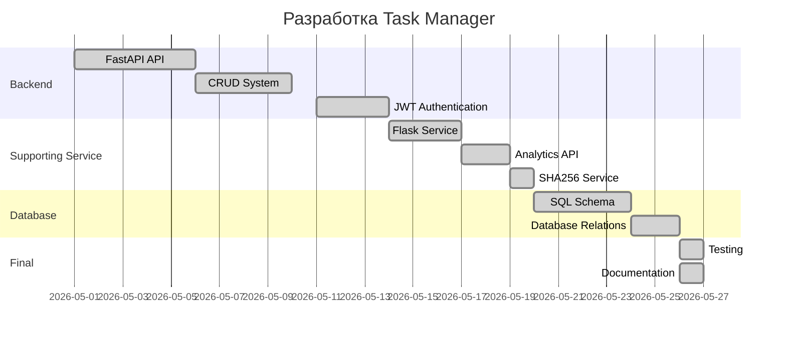

# Планировщик задач (Task Manager) 📋⏱️

**Task Manager** — это Full Stack web-приложение с элементами микросервисной архитектуры для управления личными и командными задачами.

Проект помогает:
- организовывать рабочий процесс;
- контролировать дедлайны;
- отслеживать прогресс выполнения задач;
- управлять проектами и тегами;
- вести аналитику активности пользователей.

Проект разработан в рамках курса по базам данных и backend-разработке.

Репозиторий проекта:  
:contentReference[oaicite:0]{index=0}

---

# Основные возможности ✨

## Управление задачами
- Создание задач;
- Изменение статусов;
- Установка дедлайнов;
- Приоритеты задач;
- Удаление и редактирование задач.

---

## Гибкая организация
- Группировка задач по проектам;
- Использование тегов;
- Фильтрация и сортировка задач.

---

## Kanban / Drag-and-Drop
Система поддерживает Kanban-логику для визуального управления задачами:

```text
TODO → IN PROGRESS → DONE
```

Статусы задач:
- Нужно сделать;
- В процессе;
- Готово;
- Отложено.

---

## Аналитика и Supporting Service
Flask Supporting Service предоставляет:
- analytics endpoint;
- hash endpoint;
- about endpoint;
- дополнительные сервисные API.

---

## Безопасность
- JWT авторизация;
- защищённые роуты;
- SHA256 hash service;
- разграничение ролей пользователей.

---

# Архитектура проекта 🏗️

```text
Client
   ↓
FastAPI Core Service
   ↓
MySQL Database
   ↓
Flask Supporting Service
```

---

# Core Service — FastAPI ⚡

Отвечает за:
- регистрацию пользователей;
- авторизацию;
- CRUD операции;
- работу с задачами;
- бизнес-логику;
- JWT.

---

# Supporting Service — Flask 🧩

Отвечает за:
- аналитику;
- about endpoint;
- SHA256 hash service;
- вспомогательные API.

---

# Модели данных (Сущности) 🗂️

## User

Поля:
- username
- password_hash
- role

Роли:
- user
- admin

---

## Project

Объединяет задачи в проекты.

Поля:
- name
- created_at
- user_id

---

## Task

Основная сущность системы.

Поля:
- title
- description
- deadline
- priority
- status
- project_id
- tag_id

Статусы:
- new
- in_progress
- done
- delayed

Приоритеты:
- low
- medium
- high

---

## Tag

Используется для гибкой категоризации задач.

Поля:
- name
- color

---

## Time Tracking

Используется для отслеживания времени выполнения задач.

Поля:
- user_id
- task_id
- hours_spent

---

# Структура базы данных 🛢️

Основные таблицы:
- users
- tasks
- projects
- tags
- time_tracking

Связи:

```text
users
 ├── projects
 ├── tasks
 ├── tags
 └── time_tracking
```

Используются:
- PRIMARY KEY;
- FOREIGN KEY;
- CASCADE;
- SET NULL;
- AUTO_INCREMENT.

---

# Основные API endpoints 🌐

## FastAPI

### Регистрация
```http
POST /api/register
```

### Авторизация
```http
POST /api/login
```

### Получение профиля
```http
GET /api/users/{username}
```

### Обновление JWT
```http
POST /api/users/{username}/refresh-token
```

### CRUD Tasks
```http
POST /api/tasks
GET /api/tasks
PUT /api/tasks/{task_id}
DELETE /api/tasks/{task_id}
```

---

## Flask Supporting Service

### Analytics
```http
GET /api/v1/supporting/analytics
```

### About
```http
GET /api/v1/supporting/about
```

### SHA256 Hash
```http
GET /api/v1/supporting/hash/{str}
```

---

# Стек технологий 🛠️

## Backend
- Python
- FastAPI
- Flask

---

## Database
- MySQL
- SQL (без ORM)

---

## API
- REST API
- JWT Authentication

---

## Additional
- Git
- GitHub
- Mermaid
- JSON
- SHA256

---

# Как запустить проект 🚀

## 1. Клонировать репозиторий

```bash
git clone https://github.com/ColonelPavlov/Task_manager
cd Task_manager
```

---

## 2. Установить зависимости

### FastAPI
```bash
pip install fastapi uvicorn
```

### Flask
```bash
pip install flask
```

---

## 3. Запустить FastAPI

```bash
uvicorn main:app --reload
```

Сервис будет доступен:

```text
http://127.0.0.1:8000
```

---

## 4. Запустить Flask

```bash
python app.py
```

Сервис будет доступен:

```text
http://127.0.0.1:5001
```

---

# Диаграмма Ганта 📈



---

# Git Workflow 🌿

## Ветки проекта

```text
main
develop
feature/*
release/*
```

---

## Формат commit сообщений

```text
feat: add jwt authentication
fix: resolve login bug
docs: update readme
refactor: improve api structure
```

---

# Команда проекта 👨‍💻

| Роль | Ответственность | Никнейм |
|---|---|---|
| Backend Developer | API, JWT, CRUD | an-oxidizer / СаняSigmaGucci |
| Frontend Developer | Интерфейс | DieVox-RuS |
| Database Engineer | SQL, структура БД | ColonelPavlov / Amelia |
| Scrum Master | GitHub, документация, организация | CapStarCat |
| QA Engineer | Тестирование API | Y-M-Are |

---

# Scrum Master Responsibilities 📌

- Ведение GitHub Projects;
- Создание Issues;
- Планирование задач;
- Контроль commit activity;
- Подготовка документации;
- Контроль выполнения ТЗ;
- Организация командной работы.

---

# Статус проекта 📊

## Реализовано
- FastAPI service;
- Flask supporting service;
- SQL database schema;
- CRUD endpoints;
- Analytics endpoint;
- SHA256 endpoint;
- About endpoint;
- Role system;
- Foreign key relations;
- Time tracking model.

---

## В разработке
- JWT authentication;
- Dashboard;
- Database integration;
- Protected routes;
- Replication.

---

# GitHub Activity 📅

Проект разрабатывался с использованием:
- GitHub commits;
- feature branches;
- documentation updates;
- командной разработки;
- Scrum workflow.
